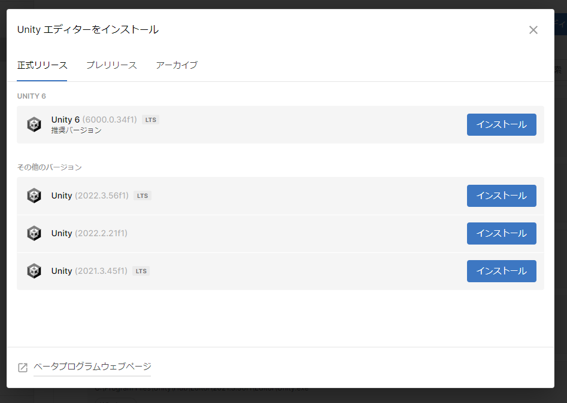
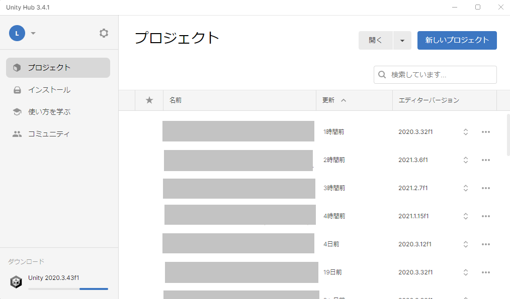
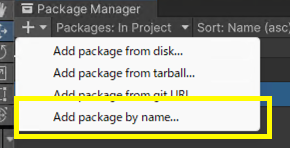
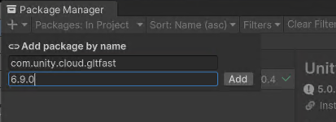
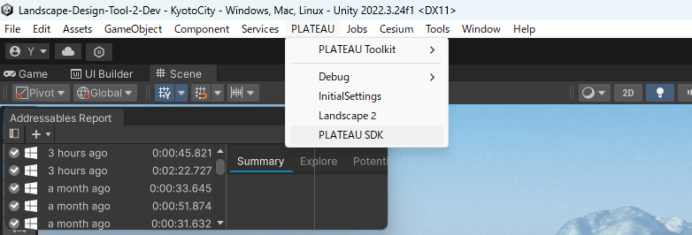
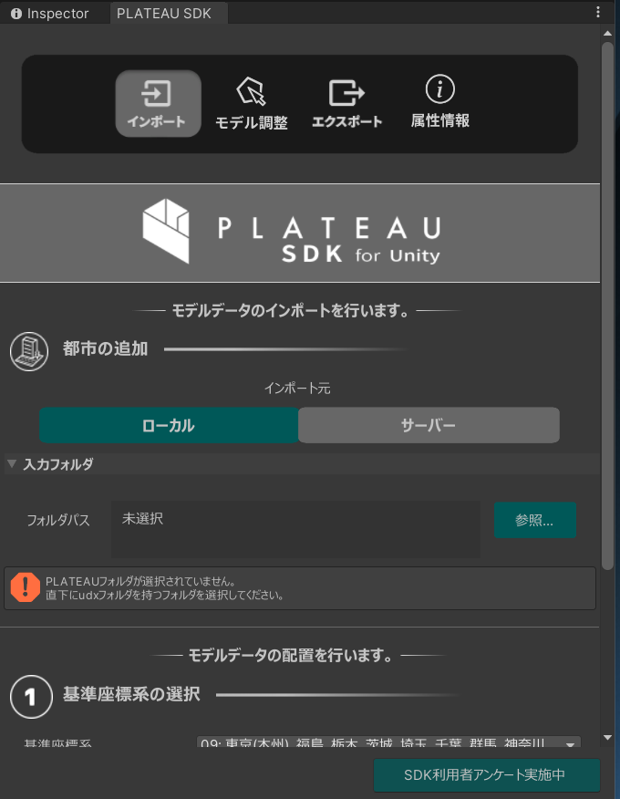
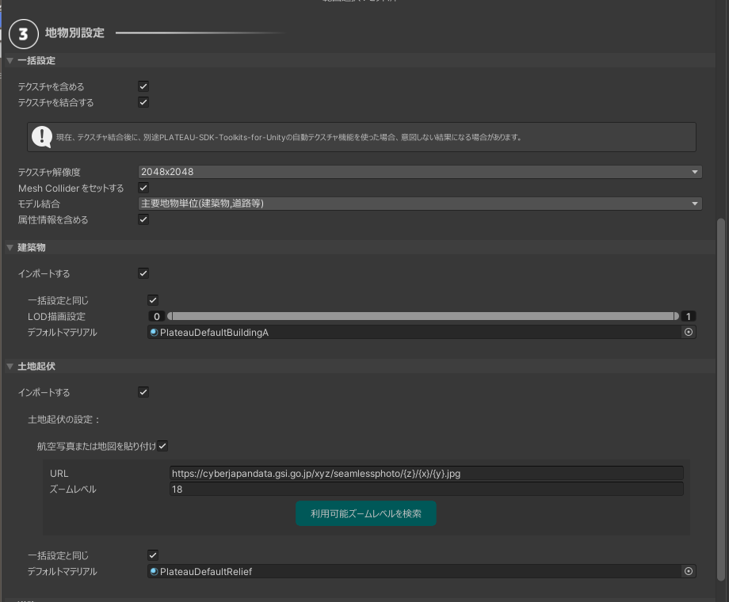
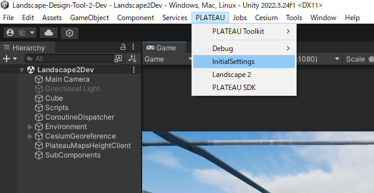

# セットアップの手順

本書では、ツールのセットアップ手順について記載しています。

## Unityのダウンロードとインストール
- Unity Hub を[こちら](https://unity3d.com/jp/get-unity/download)からインストールします。
- Unity Hub とは、Unityのお好きなバージョンをインストールして起動することのできるソフトウェアです。
- Unity Hubを起動し、左のサイドバーからインストール → 右上のボタンからエディターをインストール をクリックします。

Unity 2022.3 で始まるバージョンを選択し、インストールを押します。

## Unityプロジェクトを作成
Unity Hub を起動します。

左サイドバーの `プロジェクト` を押し、右上の `新しいプロジェクト` ボタンをクリックします。

新しいプロジェクトの設定画面で、次のように設定します。
- 画面上部の `エディターバージョン` を `2022.3` で始まる番号にします。
- 画面中部の `テンプレート` は `High Definitaion 3D` を選択します。
- 画面右下のプロジェクト名をお好みのものに設定します。
- `プロジェクトを作成` ボタンを押します。

## ツールをUnityにインポート

- 作成したプロジェクトをクリックすると、Unityが起動します。
- Unityが起動したら、以下の各ツールのリリースページからtgzファイルをダウンロードします。
  - [PLATEAU SDK for Unityのリリースページ](https://github.com/Project-PLATEAU/PLATEAU-SDK-for-Unity/releases)
  - [PLATEAU-SDK-Toolkits-for-Unityのリリースページ](https://github.com/Project-PLATEAU/PLATEAU-SDK-Toolkits-for-Unity/releases)
  - [cesium-unityのリリースページ(v1.6.3)](https://github.com/CesiumGS/cesium-unity/releases/tag/v1.6.3)
  - [LandscapeDesignToolのリリースページ](https://github.com/Synesthesias/landscape-design-tool/releases)
- また、`PLATEAU-SDK-Maps-Toolkits-for-Unity` に関しては、上記の `LandscapeDesignToolのリリースページ` にて配布している `com.unity.plateautoolkit.maps-1.0.2.tgz` をダウンロードしてください。

> [!NOTE]  
> git指定で導入する方法は以下を参考にしてください。 
> [SDKの使い方:GitのURL指定で導入する方法](https://project-plateau.github.io/PLATEAU-SDK-for-Unity/manual/Installation.html#git%E3%81%AEurl%E6%8C%87%E5%AE%9A%E3%81%A7%E5%B0%8E%E5%85%A5%E3%81%99%E3%82%8B%E6%96%B9%E6%B3%95)

- ダウンロードできたら、Unityのメニューバーから `Window` → `Package Manager` を選択します。
- Package Manager ウィンドウの左上の `＋` ボタンから `Add pacakge from tarball...` を選択します。

- 先ほどダウンロードした 各ツールの tgz ファイルを指定します。するとウィンドウのパッケージ一覧に各ツール名が表示されます。

- 続けて、`Unity gltfast` のバージョンを更新します。Package Managerウィンドウの左上の `＋` ボタンから `Add package by name...` を選択します。

- `name` に `com.unity.cloud.gltfast` を指定し、`version` に `6.9.0` を指定します。指定ができたら `Add` を押して下さい。

- packageの検索で `gltFast` を検索して、`Unity gltFast` のバージョンが `6.9.0` に更新されていることを確認できたら完了です。

- 全てのツールを導入したら、Package Manager ウィンドウを閉じます。

## Unityプロジェクトの設定

Unityのプロジェクト設定をします。メニューバーから Edit → Project Settings… を選びます。

Project Settings ウィンドウの左側のパネルから「Player」を選択し、「Api Compatibility Level」が「.NET Framework」ではない場合「.NET Framework」に変更して設定ウィンドウを閉じます。

## 事前準備
### PLATEAUの都市モデル(CityGML)データの用意
事前にG空間情報センターの[3D都市モデル（Project PLATEAU）ポータルサイト](https://front.geospatial.jp/plateau_portal_site/)から景観計画・協議を行いたいエリアの都市モデルデータ(CityGMLファイル一式)をダウンロード、解凍してください。

> [!NOTE]  
> 都市モデルデータには地形(demフォルダ), 建築物(bldgフォルダ)が含まれている必要があります。

## 都市モデルのインポート
### 都市モデルインポート画面を開く
メニューから `PLATEAU->PLATEAU SDK` を選択します。

表示されるウィンドウで都市インポートの設定を行います。インポート元を選択し、基準座標系を選んで「範囲選択」ボタンを押してください。インポート元は、ローカルの場合は 「udx」という名前のフォルダの1つ上のフォルダになります。

詳しくは [PLATEAUマニュアル: インポート](https://project-plateau.github.io/PLATEAU-SDK-for-Unity/manual/ImportCityModels.html) をご覧ください。

### 範囲選択
範囲選択画面では、マウスホイールの上下でズームイン・ズームアウト、右クリックのドラッグで視点移動します。オレンジ色の球体をドラッグして範囲を選択し、シーンビュー左上の「決定」ボタンを押します。

インポートに含める地物の種類を選択します。
景観まちづくり機能を利用するには、次をすべて満たす設定にしておく必要があります。

- 「建築物」と「土地起伏」で、「インポートする」にチェックが入っていること
- 「建築物」と「土地起伏」で、「MeshColliderをセットする」にチェックが入っていること
- 「建築物」で、「モデル結合」はそのまま（主要地物単位）にしておくこと

設定したら「モデルをインポート」ボタンを押します。そのままウィンドウを下にスクロールすると処理の進行状況が表示されるので、すべて「完了」になったらインポートは完了です。

## 初期設定機能の実行

- PLATEAU→InitialSettingsの順に選択し、初期設定画面を開きます。

- 実行に必要なコンポーネントがシーン上に全て揃っている場合、「実行」ボタンが押せる状態になります。

- 初期設定画面の「実行」ボタンを押して、初期設定の処理を開始します。

- 実行に必要なコンポーネントがシーン上に全て揃っていない場合、実行可能な状態にした後、「チェックリストを更新」ボタンを押すことで、「実行」ボタンが押せる状態になります。

- 「チェックボタンを更新」ボタンの下に「初期設定が完了しています」と表示されたら、初期設定完了です。

